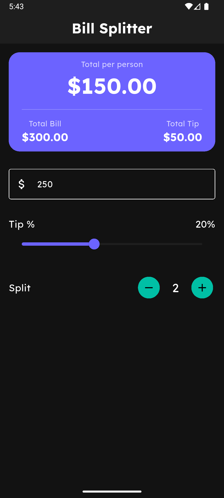

# 🧾Bill Splitter

A clean Flutter utility application to calculate tips and split the total bill.

## Preview

## Tech Stack

* **Framework**: [Flutter](https://flutter.dev/)
* **Language**: Dart
* **State Management**: `setState`

## How to run
> To run this project locally, ensure you have the Flutter SDK installed on your machine.
1. Clone the repository
2. Run `flutter pub get`
3. Run `flutter run`